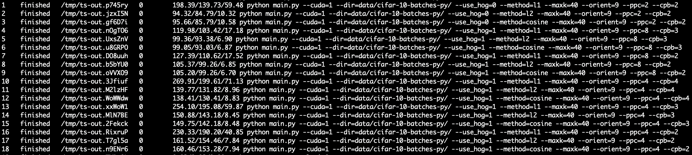

# KNN Model In Numpy With CUDA Support

> PS: It is strongly recommended to run this code with NVIDIA GTX 1080Ti

## Usage

## Feature

* GPU accelerate, higer speed. Finished 18 experiments in half an hour.

* SVM in numpy.

## Result

### KNN result

all experiment results of KNN storaged in directory result.
max acc: 0.6169

### SVM result

| Classifier | Configuration  | Accuracy |
| ---------- | -------------- | -------- |
| SVM        | lr: 1e-7       | 0.31     |
| SVM        | lr: 1e-7 + Hog | 0.33     |

## TODO

- [x] 完成基本框架
- [x] 完成README
- [x] 完成对参数K的搜索并绘制相关图表
- [x] 添加cosine特征
- [x] 添加HOG特征
- [x] 对HOG的cell/block参数做调整